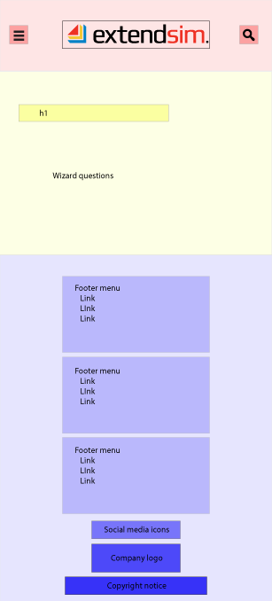
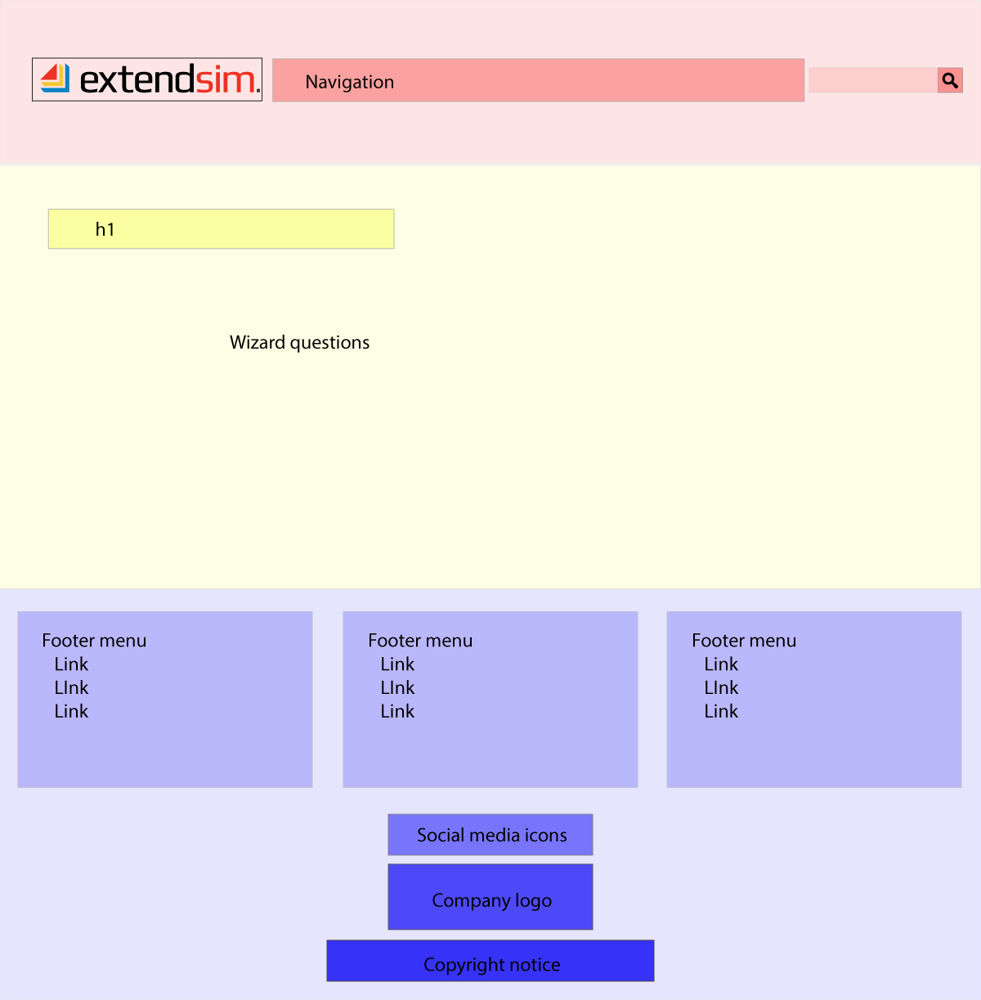
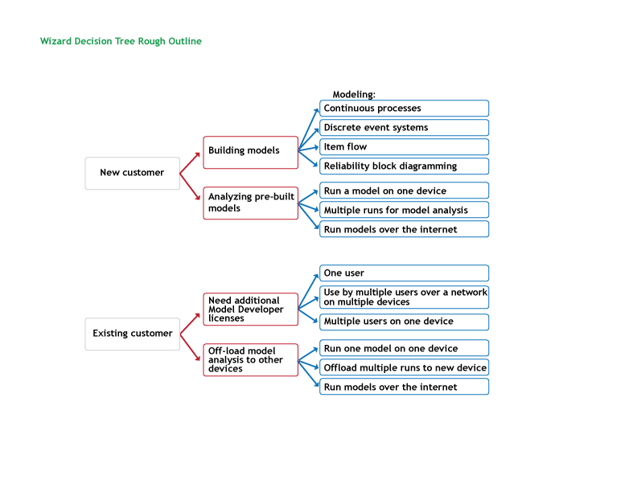

# Final Project Proposal

## Project
Create a product selection wizard for simulation software. Our company provides simulation modeling tools for those building simulation models and for those who want to do analysis using models built by others. Some are existing customers and others are new customers questioning which package would best suit them. 

Visitors to the site will be presented with a question asking about their modeling needs. Based on their response, they will be directed to new sets of related questions culminating in the appropriate solution for their needs.

This site will be based on and linked to our current web site at ExtendSim.com. 

## Goal
- Advising customers as to which package is best suited for each customer's needs takes a large portion of our sales team's time.  
- Automating this process with an online decision tree wizard will free up sales resources for other needs.

## Deliverables
Header and footer navigation panels will be comparable to the company site. The main content for the wizard will use Javascript to transition from one question to the next.  

### Wireframes & Structure
Initial design will be constructed for devices 768px wide and smaller. Top navigation will be compressed in a hamburger menu and bottom links in a vertical layout. The main container for the wizard will have vertically oriented questions and responses.
# 

For devices larger than 768px, the navigation menu will be laid out across the top horizontally. Footer links will be placed in three columns. The wizard will be in three vertically oriented columns.
# 

### Question Tree
For this project, I intend to take it to at least two levels of the decision tree. Ultimately, I'll be adding more questions to the wizard creating a more complex tree of questions.
# 